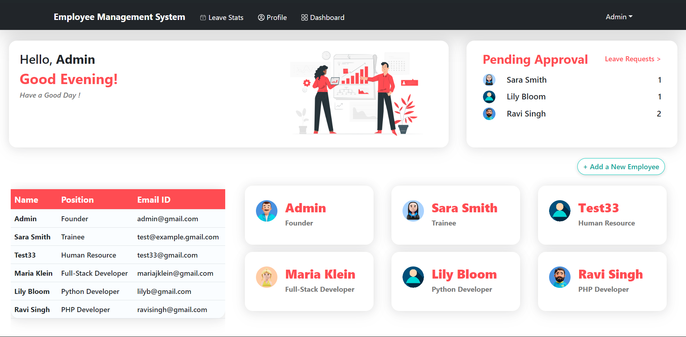
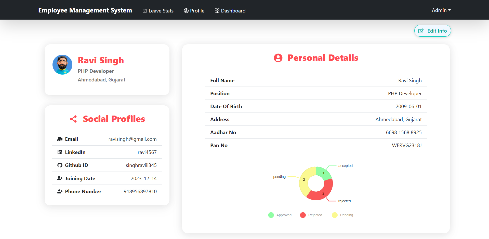

# employee-management-system
 
The Employee Management System (EMS) is a web application developed to streamline human resource management processes. It is built using the MERN (MongoDB, Express.js, React, Node.js) stack and utilizes Ant Design and React-Bootstrap for the user interface components and Chart.js for data visualization.

## Features

### Authentication
- Users can log in using their username and password.
- Accessible only by super admin, the sign-up page allows the creation of new users with specific details such as email, name, password, date of joining, position, Aadhar card number, and PAN card number.

### Profile Management
- Users can edit their username and password.
- Users can upload a profile picture.

### Leave Management
- Normal users can apply for leave and view their leave history.
- Super admin can view, approve, and reject leave requests from all users.

### Employee Management
- Normal users can view and edit their own profiles.
- Super admin has access to a list of all employees and can edit their data.

### Dashboard
- Displays relevant information for all users.
- Shows who is on leave today.
- Provides a summary of total employees and their designations.

## Technologies Used

- MongoDB: Database for storing user and employee data.
- Express.js: Backend framework for handling server-side logic.
- React: Frontend library for building user interfaces.
- Node.js: JavaScript runtime for building server-side applications.
- Ant Design & React-Bootstrap: UI library for building sleek and responsive user interfaces.
- Chart.js: Library for creating interactive and customizable charts and graphs.

## Dashboard



## Profile Page



## Installation

1. Clone the repository:
   ```bash
   git clone https://github.com/yourusername/employee-management-system.git
   ```
2. Navigate to the project directory:
   ```bash
   cd employee-management-system
   ```
3. Install dependencies for both frontend and backend:
   ```bash
   cd frontend
   npm install
   cd ../backend
   npm install
   ```
4. Set up environment variables:
   - Create a `.env` file in the `backend` directory.
   - Add MongoDB connection URI and any other necessary environment variables.

5. Run the application:
   - Start the backend server:
     ```bash
     npm start
     ```
   - Start the frontend development server:
     ```bash
     cd ../frontend
     npm start
     ```

## Usage

- Access the application in your browser at `http://localhost:3000`.
- Log in using your username and password.
- Depending on your role (normal user or super admin), you will have access to different functionalities.

## Contributing

Contributions are welcome! If you find any issues or have suggestions for improvements, please open an issue or create a pull request.
